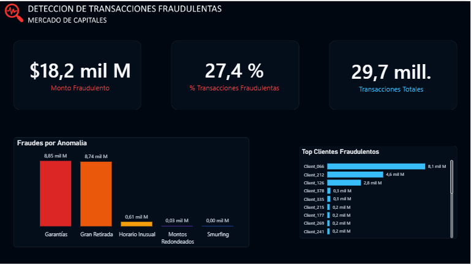
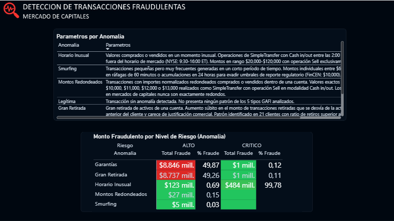

# 📊 Detección de Transacciones Fraudulentas en el Mercado de Capitales

## 🔍 1. Problema de Negocio

En los mercados de capitales, millones de transacciones financieras se ejecutan diariamente entre distintos participantes, instrumentos y mercados. Debido al alto volumen y complejidad de las operaciones, resulta difícil identificar de manera oportuna aquellas transacciones que presentan comportamientos inusuales o potencialmente fraudulentos.

Este proyecto aborda una problemática crítica:

> 📉 La detección tardía de transacciones fraudulentas puede generar pérdidas económicas, incumplimientos regulatorios y afectar la confianza del mercado.

### 🚨 ¿Por qué es importante?

✔️ Reduce el riesgo de fraude financiero.

✔️ Fortalece los procesos de monitoreo y cumplimiento (Compliance).

✔️ Permite identificar clientes e instrumentos con mayor nivel de riesgo.

✔️ Facilita la priorización de investigaciones mediante indicadores de riesgo.

## 🎯 2. Objetivo del Proyecto

Desarrollar una solución analítica de extremo a extremo utilizando Microsoft Fabric para identificar transacciones potencialmente fraudulentas mediante reglas de negocio, análisis descriptivo y visualización interactiva.

¿Qué se busca resolver?

✔️ Detectar patrones de fraude en transacciones financieras.

✔️ Clasificar clientes según su nivel de riesgo.

✔️ Cuantificar el impacto económico de las transacciones sospechosas.

✔️ Facilitar el análisis por mercados, instrumentos y tipos de anomalías.

✔️ Proporcionar una plataforma de consulta mediante IA utilizando un Agente de Datos.

## 🧩 3. Contexto y Supuestos

### 📁 Fuente de datos

Se utilizó el conjunto de datos Amaretto Dataset, desarrollado para investigación en detección de anomalías en mercados de capitales.

🔸 29.704.090 transacciones

🔸 400 clientes

🔸 68 instrumentos financieros

🔸 4 mercados

🔸 60 días de operaciones

🔸 Más de 10.000 parámetros simulados

🔸 81.262 transacciones fraudulentas (0,27%)

### 📌 Variables principales

🔸 Cliente

🔸 Fecha y hora

🔸 Mercado

🔸 Instrumento financiero

🔸 Tipo de operación

🔸 Tipo de movimiento

🔸 Clase de activo

🔸 Valor monetario

🔸 Tipo de moneda

🔸 Score de riesgo

🔸 Nivel de riesgo

🔸 Tipo de anomalía

### ⚠️ Supuestos y limitaciones

- El conjunto de datos es sintético, aunque fue generado a partir de patrones observados en mercados financieros reales.

- Las anomalías fueron diseñadas siguiendo recomendaciones del GAFI (FATF).

- No se aplicaron modelos de Machine Learning; la detección se realizó mediante reglas de negocio y análisis de comportamiento.

- El objetivo es demostrar una arquitectura moderna de analítica de datos en Microsoft Fabric.

## ⚙️ 4. Proceso Analítico

### 🟤 Bronze

Carga de los archivos originales desde Amazon S3 hacia OneLake conservando los datos sin modificaciones.

### 🥈 Silver

Procesamiento y limpieza de datos.

Actividades realizadas:

✔️ Conversión de tipos de datos.

✔️ Normalización de columnas.

✔️ Separación de fecha y hora.

✔️ Creación de indicadores de fraude.

✔️ Cálculo de scores.

✔️ Clasificación del nivel de riesgo.

✔️ Construcción de dimensiones.

### 🥇 Gold

Generación del modelo analítico.

Incluye:

✔️ Tablas de hechos.

✔️ Tablas dimensionales.

✔️ Indicadores de negocio.

✔️ Modelo semántico.

✔️ Modelo de grafos.

✔️ Agente de Datos de Microsoft Fabric.

## 🔎 5. Tipologías de Fraude Analizadas

El proyecto identifica cinco patrones principales de anomalías:

### 🔴 Gran Retirada

Incrementos inusuales en retiros o transferencias de activos respecto al comportamiento histórico del cliente.

### 🟠 Smurfing

Múltiples transacciones pequeñas ejecutadas en un corto período para evitar controles regulatorios.

### 🟡 Montos Redondeados

Operaciones con importes excesivamente redondeados, comportamiento poco habitual en mercados financieros.

### 🟣 Horario Inusual

Transacciones realizadas fuera del horario habitual de negociación.

### 🔵 Garantías

Transferencias excesivas de activos o garantías dentro y fuera de una cuenta en períodos reducidos.

## 📊 6. Visualizaciones Clave

El dashboard responde preguntas de negocio como:

📈 ¿Qué anomalía representa el mayor impacto económico?

📉 ¿Qué clientes presentan mayor nivel de riesgo?

📊 ¿Qué mercados concentran más fraude?

💰 ¿Qué instrumentos financieros presentan mayor exposición?

📅 ¿Cómo evoluciona el fraude en el tiempo?

🕒 ¿En qué horarios ocurren más transacciones sospechosas?

## 💡 7. Hallazgos Principales

El análisis permitió identificar que:

❗ Las anomalías representan únicamente el 0,27% de las transacciones, evidenciando un escenario altamente desbalanceado.

❗ El fraude se concentra en un número reducido de clientes.

❗ Determinados instrumentos financieros presentan una mayor incidencia de eventos sospechosos.

❗ Las anomalías tipo Gran Retirada y Garantías concentran el mayor impacto económico.

❗ Los scores permiten clasificar eficazmente el riesgo de cada transacción.

## 📈 8. Impacto para el Negocio

La solución permite:

📉 Detectar oportunamente transacciones sospechosas.

💰 Priorizar investigaciones según el monto comprometido.

📊 Clasificar clientes según su exposición al riesgo.

⚠️ Reducir tiempos de análisis mediante consultas inteligentes.

📑 Fortalecer procesos de auditoría y cumplimiento normativo.

## ✅ 9. Reglas de Negocio Implementadas

La clasificación del riesgo se basa en cinco indicadores principales:

✔️ Transacciones pequeñas repetitivas (Smurfing).

✔️ Montos redondeados.

✔️ Operaciones fuera del horario habitual.

✔️ Grandes retiros de activos.

✔️ Movimientos inusuales de garantías.

Cada regla genera un puntaje que contribuye al score máximo, utilizado para clasificar el nivel de riesgo de la transacción.

## 🤖 10. Inteligencia Artificial

El proyecto incorpora funcionalidades de IA mediante:

### Agente de Datos (Data Agent)

Configurado sobre el Modelo Semántico de Microsoft Fabric para responder consultas en lenguaje natural como:

- ¿Cuál es la anomalía con mayor impacto económico?

- ¿Qué clientes presentan riesgo crítico?

- ¿Qué mercado concentra más fraude?

- ¿Cuál fue el monto total fraudulento este mes

### Modelo de Grafos

Se construyó un modelo de grafos para representar las relaciones entre:

- Clientes

- Instrumentos

- Mercados

- Transacciones

- Tipos de anomalías

Esto permite identificar conexiones complejas y patrones de comportamiento difíciles de detectar mediante análisis relacional tradicional.

## 🛠️ 11. Herramientas Utilizadas

✔️ Microsoft Fabric

✔️ OneLake

✔️ Lakehouse

✔️ Notebooks (PySpark)

✔️ SQL Endpoint

✔️ Modelo Semántico

✔️ Modelo de Grafos (Graph)

✔️ Data Agent

✔️ Power BI

✔️ Amazon S3

## 🏗️ 12. Arquitectura del Proyecto

Se utilizó arquitectura Medallion:

## 📊 13. Dashboard

El dashboard desarrollado permite:

✔️ Monitorear indicadores de fraude en tiempo real.

✔️ Analizar transacciones por anomalía.

✔️ Evaluar clientes con mayor riesgo.

✔️ Identificar mercados e instrumentos más expuestos.

✔️ Analizar tendencias temporales.

✔️ Explorar relaciones mediante filtros dinámicos.

## 🧠 14. ¿Qué demuestra este proyecto?

✔️ Diseño de una arquitectura moderna de datos con Microsoft Fabric.

✔️ Implementación de la arquitectura Medallion (Bronze, Silver y Gold).

✔️ Desarrollo de modelos semánticos para análisis empresarial.

✔️ Construcción de modelos de grafos para análisis relacional.

✔️ Configuración de Agentes de Datos con Inteligencia Artificial.

✔️ Desarrollo de dashboards ejecutivos en Power BI.

✔️ Aplicación de reglas de negocio para detección de fraude financiero.

✔️ Integración de servicios cloud en una solución analítica de extremo a extremo.

## 📌 15. Conclusión

> Este proyecto demuestra cómo una arquitectura moderna basada en Microsoft Fabric permite integrar ingeniería de datos, modelado semántico, análisis relacional mediante grafos, inteligencia artificial y visualización avanzada para detectar transacciones fraudulentas en el mercado de capitales.

> La solución no solo facilita la identificación de patrones sospechosos y la clasificación del riesgo, sino que también proporciona herramientas para que analistas y responsables de cumplimiento exploren la información mediante consultas en lenguaje natural, fortaleciendo la toma de decisiones y la gestión del riesgo financiero en organizaciones del sector bancario y de mercados de capitales.
